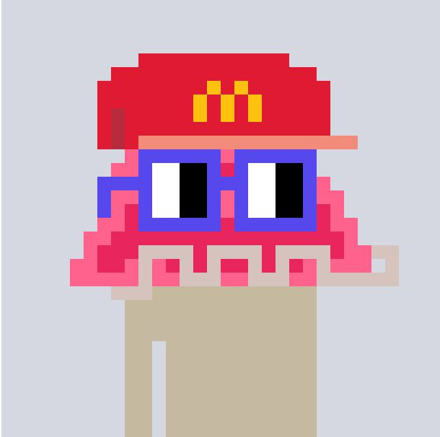

# Exhibit

Contracts for Exhibit, a platform to monetize your NFTs.

### User workflow

- As an advertizer, you bid on the Nouns NFT you like (already minted), providing your bid amount, the duration you want to advertize on and the mask data in the form of a SVG file. In the example above, the McDonalds hat is the the ad.

- Once the first person submits a bid, an ascending English auction gets started with a 15 minutes cooling period. If someone outbids you, you get your bid amount back and the 15 minutes window is reset. This goes on until no one is left in the auction.

- Anyone can then settle the auction and add the "ad" mask to be reviewed by the owner of the NFT within the next 60 minutes. The owner gets a notification saying "Someone wants to advertise on your NFT". This is to make sure there's no spam or undesirable ads. Once the owner approves the ad, the original NFT gets locked in a escrow in the ExhibitBase (or the base token) contract and you get minted a new Exhibit base token, mirroring you original token metadata but with an additional ad or "mask" attribute.

- The owner of the token is streamed payments for the duration of the ad using Superfluid which ensures payments to the right person if the wrapped NFT token is transferred to someone else. This also means if the ad is not performing well, the advertizer can pull out of the auction or the owner of the NFT is not left with a bad ad.

- Once the ad duration is over, the Exhibit base token is burned and the original NFT is released from the escrow. This process can continues.

**Note**: Given the slight latency delay between first creating a bid and the ad being applied, you can create a bid 15 minutes prior to the end of the auction to ensure you get the ad applied as soon as the auction ends.

## Design

Go to [design-doc.md](./design-doc.md) for the design doc.

## Development

Go to the [exhibit-ui](https://github.com/exhibit-xyz/exhibit-ui) repo for the UI.

TODO

